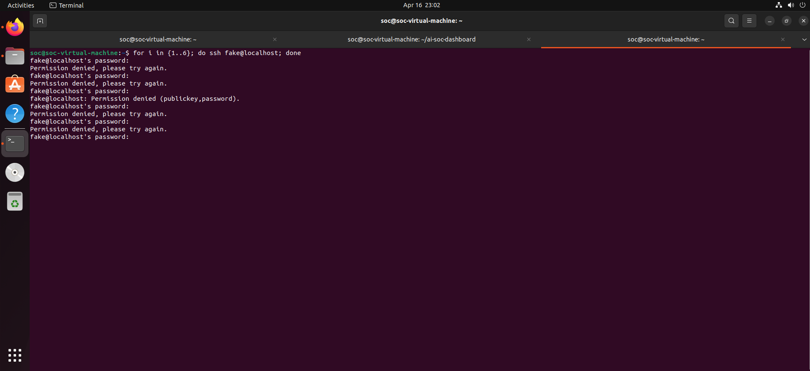
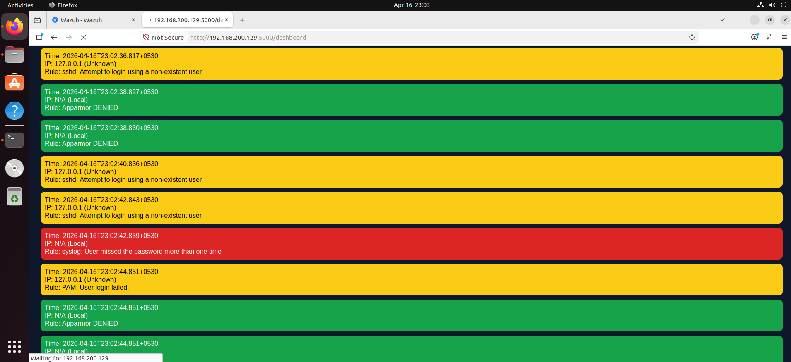
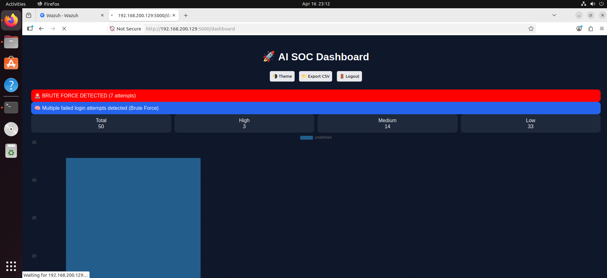

# 🚀 AI SOC Dashboard

A real-time Security Operations Center (SOC) dashboard built using Python and Flask, integrated with Wazuh SIEM to detect and visualize cyber threats.

---

## 🔥 Features

- 🚨 Real-time alert monitoring  
- 🔴 Brute force attack detection  
- 📊 Live charts & analytics  
- 🌍 Geo-IP tracking  
- 🤖 AI-based alert insights  
- 📩 Telegram alert integration  
- 🔐 Secure login system  
- 🌗 Dark/Light mode  
- 📁 CSV export support  

---

## 🛠️ Tech Stack

- Python (Flask)
- Wazuh SIEM
- HTML, CSS, JavaScript
- Chart.js
- Linux (Ubuntu)

---

## 📸 Screenshots

### 🔐 Login Page

### 📊 Dashboard

### 🚨 Brute Force Detection

---

## ⚡ How It Works

- Wazuh monitors system logs  
- Alerts are stored in `alerts.json`  
- Flask reads alerts in real-time  
- Dashboard visualizes threats  
- AI logic detects brute force attempts  

---

## 🎯 Use Case

This project simulates a real SOC environment where security analysts can:
- Monitor threats  
- Detect attacks  
- Respond quickly  

---

## 💼 Author

**Imaad Ul Haq**  
Cybersecurity Enthusiast | SOC Analyst Learner
